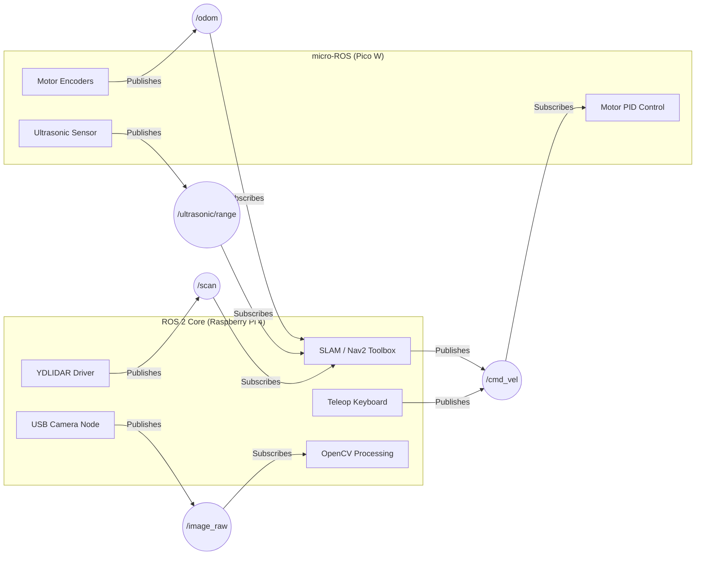

```mermaid
graph LR
    %% Hardware Subgraphs
    subgraph PICO ["micro-ROS (Pico W)"]
        enc[Motor Encoders]
        us[Ultrasonic Sensor]
        pid[Motor PID Control]
    end

    subgraph RPI ["ROS 2 Core (Raspberry Pi 4)"]
        slam[SLAM / Nav2 Toolbox]
        teleop[Teleop Keyboard]
        ydlidar[YDLIDAR Driver]
        cam[USB Camera Node]
        cv[OpenCV Processing]
    end

    %% Topics (Circles)
    cmd((/cmd_vel))
    odom((/odom))
    scan((/scan))
    ultra((/ultrasonic/range))
    img((/image_raw))

    %% Data Flow 
    teleop -->|Publishes| cmd
    slam -->|Publishes| cmd
    cmd -->|Subscribes| pid

    enc -->|Publishes| odom
    odom -->|Subscribes| slam

    ydlidar -->|Publishes| scan
    scan -->|Subscribes| slam

    us -->|Publishes| ultra
    ultra -->|Subscribes| slam

    cam -->|Publishes| img
    img -->|Subscribes| cv
```