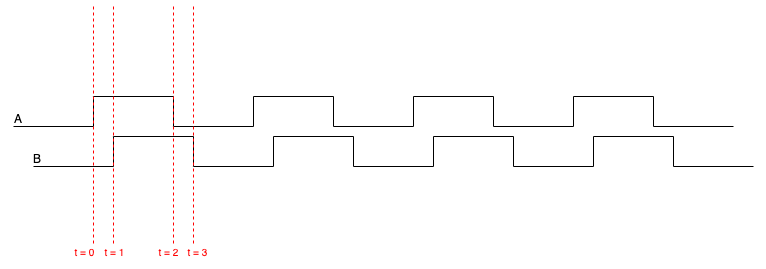
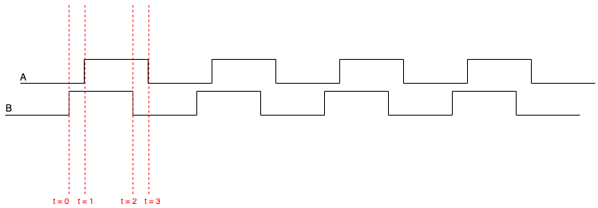

Encoder
=======

See also: :doc:`main.cpp <main_cpp>`

Purpose
-------

The ``Encoder`` class reads how far each wheel has turned. It counts the pulses
from a quadrature encoder using GPIO interrupts, and it can report both the tick
count and the wheel speed in metres per second.

How quadrature works
--------------------

A quadrature encoder gives two square wave signals, channel A and channel B,
that are a quarter cycle apart. As the shaft turns, each channel produces rising
and falling edges. The order of the edges on A and B tells you which way the
wheel is turning.

.. list-table::
    :header-rows: 1
    :widths: 30 30 40

    *   - Event
        - Condition
        - Result
    *   - Pin A rises
        - B is LOW (A is not equal to B)
        - ``count++`` (forward)
    *   - Pin A rises
        - B is HIGH (A equals B)
        - ``count--`` (backward)
    *   - Pin B rises
        - A is HIGH (A equals B)
        - ``count++`` (forward)
    *   - Pin B rises
        - A is LOW (A is not equal to B)
        - ``count--`` (backward)

The ``count`` variable is marked ``volatile`` because it is changed inside the
interrupt handler and read in the main loop. That tells the compiler to always
read it back from memory instead of keeping a stale copy in a register.

Scenario 1: A leads B (forward)
-------------------------------

- At t=0, A rises while B is still LOW, so ``count++``
- At t=1, B rises while A is HIGH, so ``count++``
- The result is two counts forward

Scenario 2: B leads A (backward)
--------------------------------

- At t=0, B rises while A is still LOW, so ``count--``
- At t=1, A rises while B is HIGH, so ``count--``
- The result is two counts backward

.. note::

    The count tracks net movement, not total distance. If the tank rolls
    forward one metre and then back one metre, the count returns to zero.

Counts per wheel turn
---------------------

The number of counts for one full turn of the wheel depends on the encoder
pulses, the gearbox, and the fact that the decoder counts both edges of both
channels:

.. math::

    \text{counts per wheel turn} = 4 \times \text{PPR} \times \text{gear reduction}

For this tank the encoder has 11 pulses per motor turn and the gearbox reduction
is 131, so:

.. math::

    4 \times 11 \times 131 = 5764 \text{ counts per wheel turn}

Setup
-----

The constructor works out the wheel circumference from the diameter, works out
the counts per wheel turn, and sets up the pins. Both channel pins are inputs
with pull up resistors, which hold them HIGH when there is no signal and stop
false edges from electrical noise.

The Pico allows only one GPIO interrupt callback per core. So the first encoder
registers the shared callback, and any later encoder only enables its pins and
reuses that same callback:

.. code-block:: cpp

    gpio_set_irq_enabled_with_callback(pin_a, GPIO_IRQ_EDGE_RISE | GPIO_IRQ_EDGE_FALL,
                                       true, &Encoder::irq_handler);

    gpio_set_irq_enabled(pin_a, GPIO_IRQ_EDGE_RISE | GPIO_IRQ_EDGE_FALL, true);
    gpio_set_irq_enabled(pin_b, GPIO_IRQ_EDGE_RISE | GPIO_IRQ_EDGE_FALL, true);

Handling the interrupt
----------------------

Every edge goes to the one static ``irq_handler``, which loops over the
registered encoders and calls ``handle_irq`` on each. ``handle_irq`` first
checks that the pin belongs to that encoder, then applies the quadrature rule
to move the count up or down.

Methods
-------

.. cpp:function:: int get_count()

Returns the signed tick count. Interrupts are turned off for the moment of the
read so the value cannot change halfway through. If the encoder was set up as
inverted, the sign is flipped.

.. cpp:function:: float get_vel()

Returns the wheel speed in metres per second. It works out the time since the
last call, finds the change in counts, turns that into a distance, and divides
by the time:

.. math::

    v = \frac{\Delta\text{counts}}{\text{counts per wheel turn}} \times
        \frac{C}{\Delta t}

where ``C`` is the wheel circumference. The time step is floored at one
millisecond to keep the result steady, the first call returns zero, and the
speed is passed through an exponential moving average so it is smoother.
