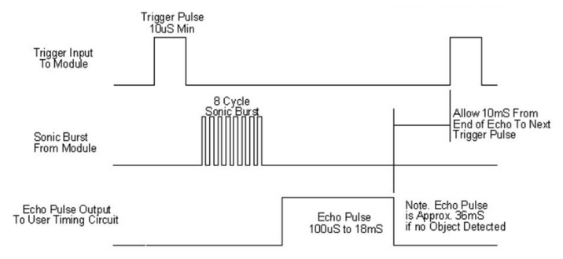

Ultrasonic Sensor
=================

See also: :doc:`main.cpp <main_cpp>`

Purpose
-------

The ``Ultrasonic`` class drives one ultrasonic distance sensor. Each sensor has
a trigger pin and an echo pin. The class fires a reading on demand and returns
the distance in metres.

How the sensor works
--------------------

The sensor has a transmitter and a receiver. It sends out a short burst of sound
above the range of human hearing, then listens for the echo that bounces back
off an object. The time the echo takes to return tells you the distance.

A reading has four parts:

1. The trigger pin is pulled HIGH for a short pulse, then LOW. This tells the
   sensor to fire.
2. The sensor sends out the burst of sound.
3. The echo pin goes HIGH while the sensor waits for the sound to come back.
4. When the echo returns, the echo pin goes LOW. The time the echo pin stayed
   HIGH is the round trip time of the sound.

Working out the distance
------------------------

Once the echo time is known, the distance is:

.. math::

    d = \frac{t \times v_s}{2}

where ``t`` is the echo time in seconds and ``v_s`` is the speed of sound, about
346 metres per second at room temperature. The result is halved because the
sound travels to the object and back, so the echo time covers twice the
distance. In this code the result is returned in metres.

The update method
-----------------

``update()`` fires the sensor and waits for the echo. It is a blocking call, so
it holds the processor until the echo returns or a timeout is reached. The
timeout is about 38 milliseconds. The return values are:

- ``-1.0`` when the echo never starts, which means no object or a wiring fault
- ``-2.0`` when the echo starts but never ends, which can happen when an object
  is far too close
- any positive value, which is a valid distance in metres

Firing one at a time
--------------------

In the main loop only one sensor fires per cycle, using a rotating index. Since
each reading can block for a while, spacing them out keeps the loop timing
steady and stops one sensor from hearing another sensor burst.
