Reflections
================================

See also: :doc:`ROS 2 Notes <ros2>`

A personal log of difficulties faced, solutions found, and lessons learned
while building the autonomous tank.

Background
----------
From the two years into uni, I realised I wasn't actually learning the things I cared about. AI and robotics. None of that was coming from lectures. So I decided to just go build something on my own.

In Y3S2 (during my internship at ST Engineering), I realised that past 2 years in Uni did not exactly prepare me enough for what I might face in the future. Especially with my interest in AI and Robotics, I needed to take matters in my own hands and actually learn meaningful things that will help me in expanding my knowledge pool and also in my future career. 

I figured if I could build something real using sensors, SLAM, Nav2, I'd come out the other side actually understanding robotics. Moreover, with my VLA-based FYP for robotics systems in my final year, having this hands-on foundation felt important to me.

I decided to build a self-driving tank. Why a tank you may ask. If I'm being honest, part of it is that I've been fascinated by tanks since I was a kid (spent abit too much time playing world of tanks), so building one felt like the obvious choice. But beyond the nerdy appeal, I also knew that actually building something physical was the only way I'd retain any of this. I needed something I could break, fix, and learn from.

----

26 Feb 26 — Start of Project
------------------------------

After researching and consulting AI what I should purchase, I spend nearly a crazy ~$200 out of my own pocket to purchase the items that included Rasberry Pi 4, Pico W, Pi Camera Module 2, YDLidar X3 Pro, basic arduino car kit (included with motors), H bridge, 18560 batteries.

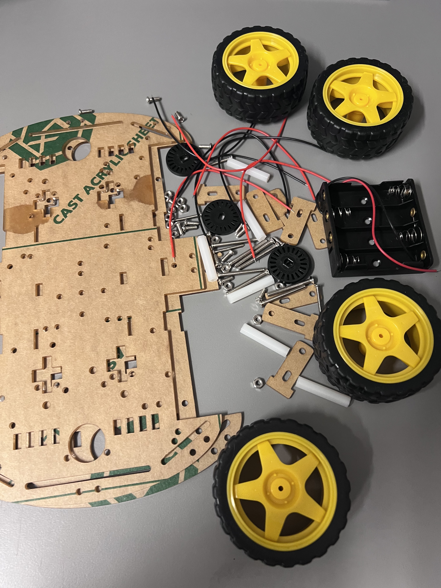

   Figure 1: Before building version 1

When the kit in Figure 1 came, I couldn't wait to start. I followed some YouTube Tutorial on it and started building. I learnt how to write a simple micropython script and then make it such that it recieves the velocity commands over USB to my RPI4. I've heard that ROS was a pain to set up, so I deliberately kept it out of the picture, so I can focus in ensuring hardware and my python script is correct.

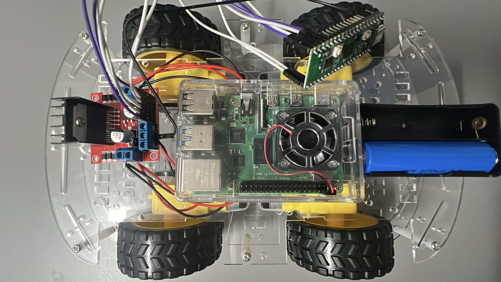

   Figure 2: After building version 1

As shown in Figure 2 above, my current build contains RPI4, Pico W, 18650 batteries, the L298N H Bridge that is wired to my motors. The L298N required many connections. For a 4 wheel (4 motor) setup, I had to combine the motor voltage wires together for each side. Dir pins control both motors at each side.

This "simple" setup, took me awhile because of many problems. The table below shows some problems faced and respective solutions.

.. list-table::
   :header-rows: 1
   :widths: 50 50

   *  - Problem
      - Solution

   *  - weak (loose) connection
      - wiggle the wires to make sure they don't just fall out and secure them if they do fall out
   *  - code issues
      - make changes to the code and verify with AI (my project mentor)
   *  - motor forward/backward direction issues
      - switch the pins (best to switch it hardware wise than software which might confuse myself in the future when reviewing the codebase)
   *  - cold solder joints
      - fill edges of soldering iron's tip with solder first, repeat it multiple times, and ensure that soldering joint is hot

This first success building the car made me more motivated and excited to continue on with my project. 

.. raw:: html

   <figure style="text-align: center;">
   <video width="640" height="360" controls style="display: block; margin: auto;">
      <source src="../_static/reflections_vid1.mp4" type="video/mp4">
      Your browser does not support the video tag.
   </video>
   <figcaption style="color: gray; margin-top: 0.8em;">Video 1: Car moving around and spinning</figcaption>
   </figure>

Video 1 above shows my car finally moving, controlled via my keyboard, WASD.

----

12 Mar 26 — 1st Real Difficulty
--------------------------------

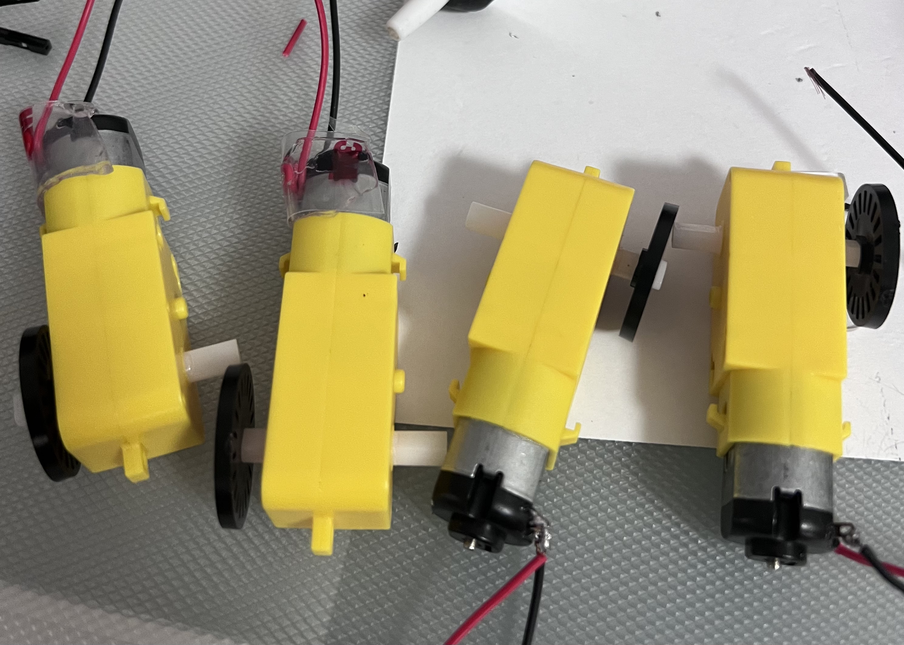

   Figure 3: Poor solder joint on my motors

From Figure 3, we can see that I took out the motors. This is because the motors were not reliable due to bad solder joint.

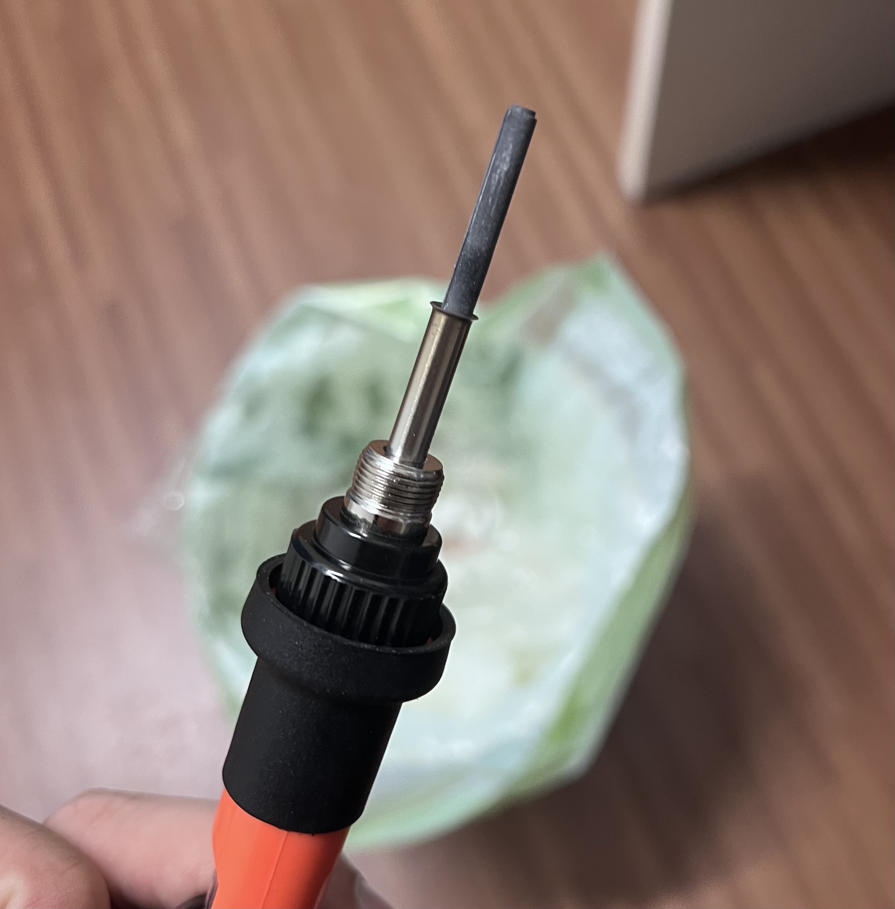

   Figure 4: Poor soldering iron quality

From Figure 4, you can tell that I was using a really cheap soldering iron and the solder connections became so unreliable, sometimes the car won't even move. This was when I knew I had to invest in a good soldering setup to ensure issues like these won't arise in the future again. I bought a new soldering iron (reddit users recommendations) and seperate quality solder with higher flux percentage.

When the new soldering iron came, I soldered on new pair of wires onto the motor flaps and everything worked. I knew the next steps were to add my LIDAR and bigger portable onto my car.

26 Mar 26 — Improved Chassis, or is it?
-----------------------------------------

When I fitted the my bigger powerbank, everything changed. The whole system got heavier, and my cheap TT motors were struggling to move the car. When moving forward or backwards, it worked fine. But when it was tank turning left or right, it didn't budge. This is because the TT motors are not producing enough torque force to overcome the static friction.

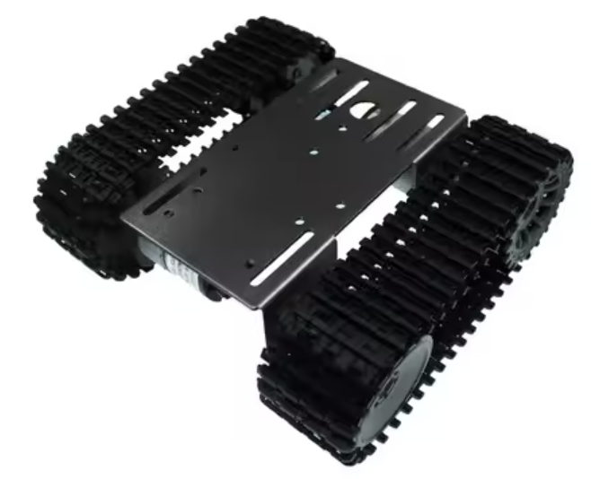

   Figure 5: New chassis & motor

From Figure 5, we can see that I am using the TP-101 chassis with 2 provided 33GB-520 motors. The tank chassis certainly helped with distribution the weight across the tracks.

The specifications of both are displayed in the table below.

.. list-table::
   :header-rows: 1
   :stub-columns: 1
   :widths: 15 20 20

   *  -
      - Old Chassis w TT Motors
      - New Chassis w 33GB-520 Motors

   *  - Number of Motors
      - 4 Motors
      - 2 Motors

   *  - Voltage
      - 3-6 V
      - 6-12 V

   *  - No-load Speed
      - 90-200 RPM
      - 170-350 RPM

   *  - Max Torque (all motors combined)
      - 3.2 kg cm
      - 5 kg cm

   *  - Gearbox
      - Plastic
      - All metal

   *  - Current (no-load)
      - 170-250 mA
      - 100 mA

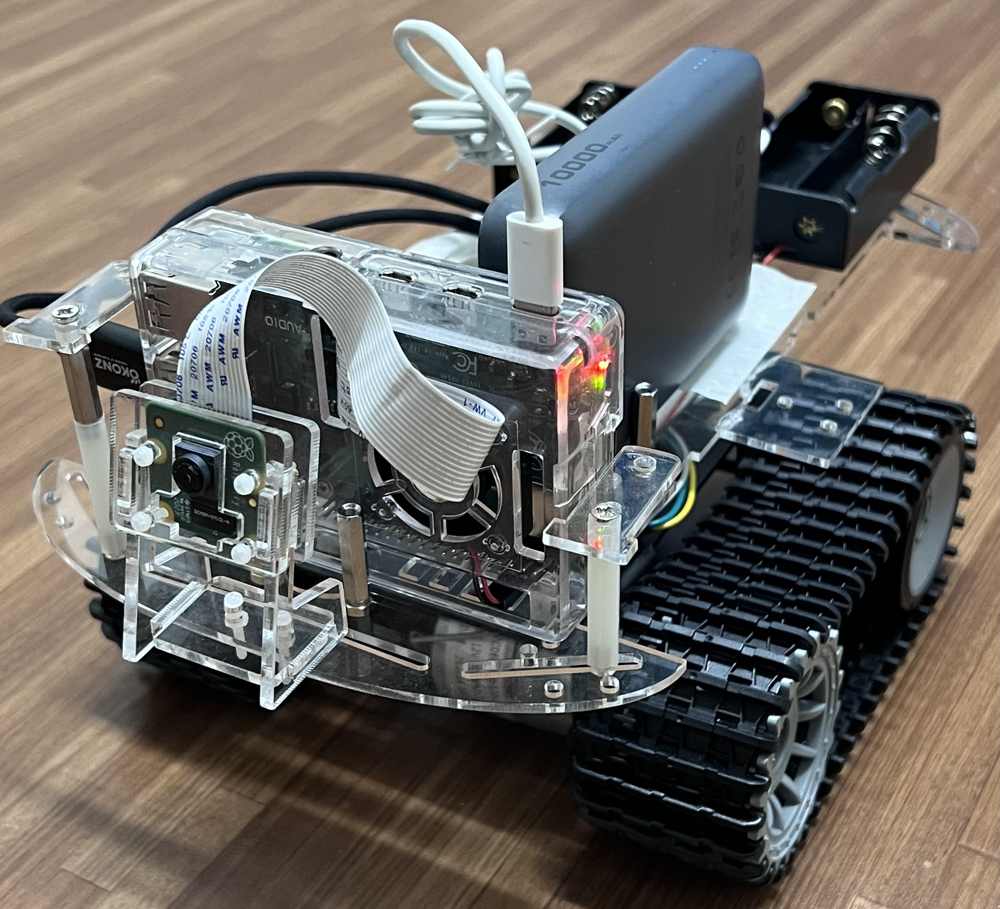

   Figure 6: After building

Figure 6 shows the final product after building. Notice the rasberry camera module 2 installed. I tested it by streaming live feed and viewing it on my macbook via VLC player. I noticed that the camera FOV is small. This might impact the robot's ability to see things at corners of the image. Therefore, I have decided to get another camera that have a greater FOV.

9 Apr 26 — Camera problems
---------------------------

.. list-table::
   :header-rows: 1
   :stub-columns: 1
   :widths: 15 20 20

   *  -
      - RPI Camera Module 2
      - OV5647 130 degrees

   *  - Sensor
      - Sony IMX219
      - OmniVision OV5647

   *  - Resolution
      - 8MP
      - 5MP

   *  - Horizontal FOV
      - 62.2 degrees
      - 130 degrees

   *  - Focal Length
      - F2.0
      - F2.9

When I got the OV5647, I tried it and observed a larger FOV. However, when it took it and pulled the latch on the Camera Serial Interface (CSI) to unlock it (so that I can remove the ribbon attached to my OV5637, it **broke**.

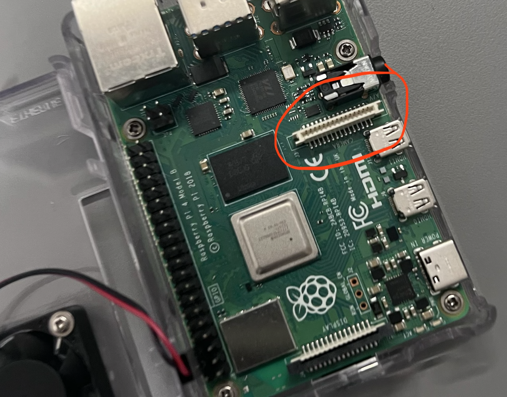

   Figure 7: Broken latch

Figure 7 shows my destroyed CSI. I looked up online and realised that the CSI is notorious for getting damaged. I could replace the whole CSI piece and solder on a new one, or I could get a USB camera. I didn't take the risk, and bought a USB camera with similar FOV. 

9 Apr 26 — Lack of Encoder & Motor Driver Upgrade
---------------------------------------------------

I began researching more into SLAM, and realised that I need an encoder for my wheel so that I can calculate the odometry for my base_link.

I had a choice of adding an encoder to my current motor, but it wasn't feasible as it might increase inaccuracies (since there are more hardware building), and I wouldn't wanna mess up the encoder accuracy since that directly affects drift.

Therefore, I decided to purchase the JBG37-520-12V-60RPM with Encoder already attached to it. The table below shows the differences.

.. list-table::
   :header-rows: 1
   :stub-columns: 1
   :widths: 15 20 25

   *  - 
      - 33GB-520
      - JBG37-520-12V-60RPM with Encoder

   *  - Encoder
      - No
      - Yes

   *  - Working Voltage
      - 6-12 V
      - 12 V

   *  - Rated Torque (per motor)
      - 1.6 kg cm
      - up to 30 kg cm (at 37 RPM)

   *  - No-load Speed
      - 170-350 RPM
      - 70 RPM

From the table above, we can see that JBG37-520-12V-60RPM motor gives ALOT of torque, and that is good for my application where speed is not really important, but torque and precision in movement is.

JBG37-520 uses AB-phase Quadrature Hall Encoders. The encoder outputs 11 Pulses per Revolution (PPR). This means that the effective output shaft resolution is ``11 * gear_ratio``. For this 60RPM variant, it is around 1848 counts/rev which is excellent resolution.

Additionally, the existing H-bridge proved to be quite inefficient, dissipating a significant amount of energy as heat, with a voltage drop of nearly 2V across it. To address this, I sourced the Cytron MDD10A Dual Channel 10A DC Motor Driver, which uses a fully NMOS H-Bridge design to achieve significantly lower voltage drop and improved efficiency.

16 Apr 26 — Motor Mismatch + LIDAR's custom fit
-------------------------------------------------

When the motor came, I eagerly tried to yoink it in place. But to my surprise, it didn't fit. I did check the shaft dimensions before purchasing, but turned out the old motor I was using had a different sizing from the spec sheet found online.

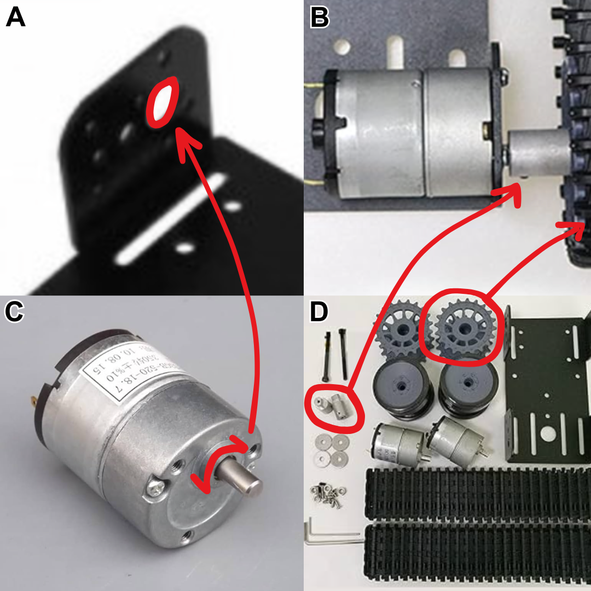

   Figure 8: Motor to Chassis Connection

From Figure 8 above, we can see the different parts required to connect the motor shaft to the drive wheel. First, the mini motor housing extrusion of C has to fit through the hole in A. Coupler in D is then attached onto motor shaft, and attached to drive wheel as shown in B.

However, my new motor's housing extrusion can't fit through the hole in A, and the coupler couldn't attach to the motor shaft.

To fix this, I have decided to customize my chassis by:

1) **3D printing** my own custom chassis with custom coupler
2) Mounting my LIDAR on custom **acrylic**

27 Apr 26 — Acrylic
-----------------------

For acrlyic, my main goal is just to drill holes so that I can fit my LIDAR. 

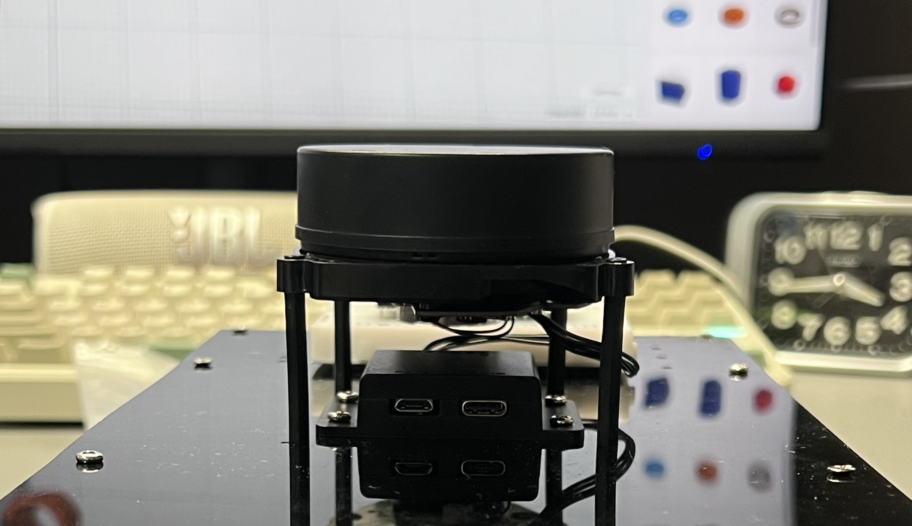

   Figure 9: 3D model of chassis

Figure 9 shows how it looked like.

20 Apr 26 — 3D Prints
-----------------------

As for the 3D printing, I saw this as an opportunity for me to learn 3D design, and I downloaded Autodesk Fusion. I spent the first few hours watching youtube tutorials and then I got started.

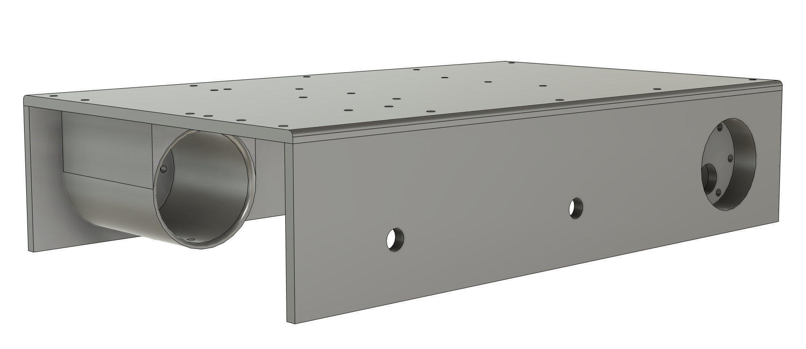

   Figure 10: 3D model of chassis

Figure 10 shows the overall 3D view of the chassis. It features motor mounts for me to slide in the motors and secure with screws. At the top are holes for me to add standoffs to secure my components such as powerbank, motor driver, RPI4 and 18650 batteries.

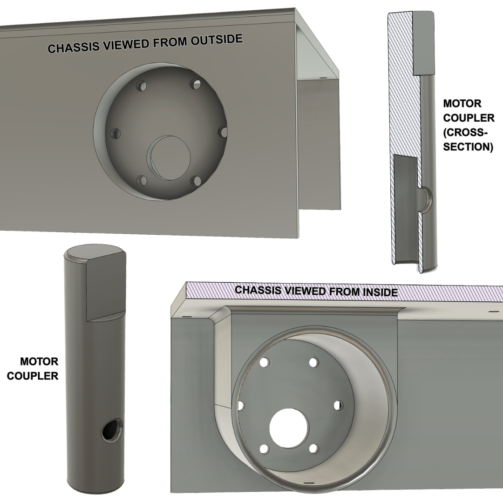

   Figure 11: Details of Chassis & Motor Coupler

Figure 11 shows the details of the designs. The motor housing is intentionally pushed slightly inwards due to its longer extrusion (at the shaft) compared to the previous motor. Moreover, there are also 5 screw holes for secure fit. As for the coupler, it is a simple design where the shaft slides into the bottom and the drive wheel slides in at the top.

Some issues faced with this design was that the shaft turned while the coupler stayed in place. This made me learn about tolerances and how we have to account for that. Also, the length of coupler was not accurate. This meant that my drive wheel and supporting wheel were not aligned with respect to the track. Therefore, I had to re-measure and print a few more with (slight) differing lengths.

26 Apr 26 — How I learn coding/ROS 2
--------------------------------------

   ~ holy trinity ~

Throughout the whole process while waiting for shipment to arrive (usually takes a week or two), I would take this time to brush up on my python, learn my C++, and also learn ROS from scratch. I found it a very big challenge at the beginning because this is all completely new to me.

My process was as such. First I used AI to teach me the relevant concepts. I will then ask it to generate some questions/practice for me to do. After that, it will check my code and also my output and give me my score. If I still don't feel confident about that particular exercise, I will ask it generate another one. Only when I understand at least 80% of it, I will ask it to teach me another concept. The exercise portion is so that I can learn actively instead of passively.

Also, I chose python for my codebase for RPI4 because its easier. When the full pipeline works, I might explore C++.

27 Apr 26 — Minor Upgrades: Ultrasonic Sensors and Electrical Schematics
-------------------------------------------------------------------------

I decided to get some new ultrasonic sensors and then decided to plan out the schematics and pin allocations. 

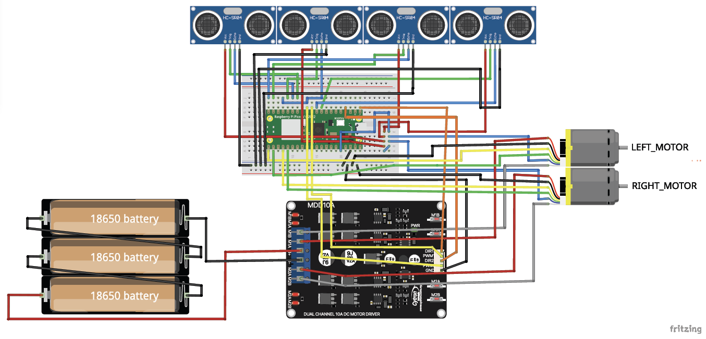

   Figure 12: Fritzing Schematics

Figure 12 shows the schematics that I have created using Fritzing (an open-soruce application). It shows my main electronics used for connections. Since this is just prototyping, I am using a half sized breadboard and jumper wires for my wiring.

28 Apr 26 — Finished Hardware
-------------------------------

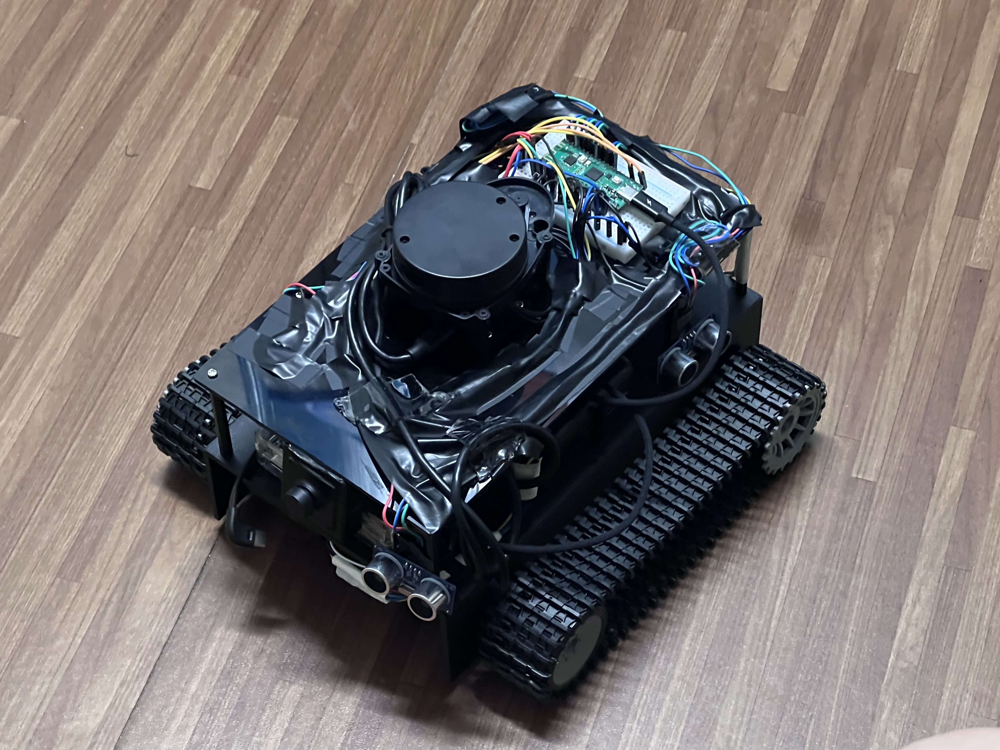

   Figure 13: Finished Hardware

Figure 13 shows my completed hardware. At this point, I already have my main.cpp for my micro-ROS ready to be flashed onto my 

29 Apr 26 — E-Stop Function using Ultrasonic Sensors
-----------------------------------------------------

.. raw:: html

   <figure style="text-align: center;">
   <video width="640" height="360" controls style="display: block; margin: auto;">
      <source src="../_static/reflections_vid2.mp4" type="video/mp4">
      Your browser does not support the video tag.
   </video>
   <figcaption style="color: gray; margin-top: 0.8em;">Video 2: Car stopping when 15cm from an object</figcaption>
   </figure>

Video 2 shows the simple E-stop function using my ultrasonic sensors. It will stop when it detects an object 15cm in front and behind it. 

5 May 2026 — PID Controller
-----------------------------
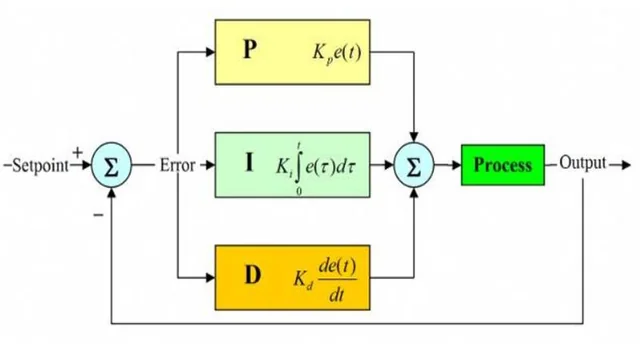

   Figure 14: Finished Hardware

I decided to first brush up on my concept of PID controller. Having studied this in theory and now using it irl, it was a step up. I knew that i should first begin with P, and gradually add in I and D and tune in base on how the car reacts.

When I calculate the PID values, I had to see the maximum error possible. Assuming maximum error, I can calculate the maximum PID output, and ensure that it doesn't go out of the maximum allowed value, i.e. saturation. Besides having a PID controller, we have a feedforward path that provides 80% of the motion, with PID just affect 20% of the final output by making tiny adjustments to the pwm.

I also added a slew rate that allows for smoother acceleration and deceleration.

6 May 2026 — Disaster #2
-----------------------------
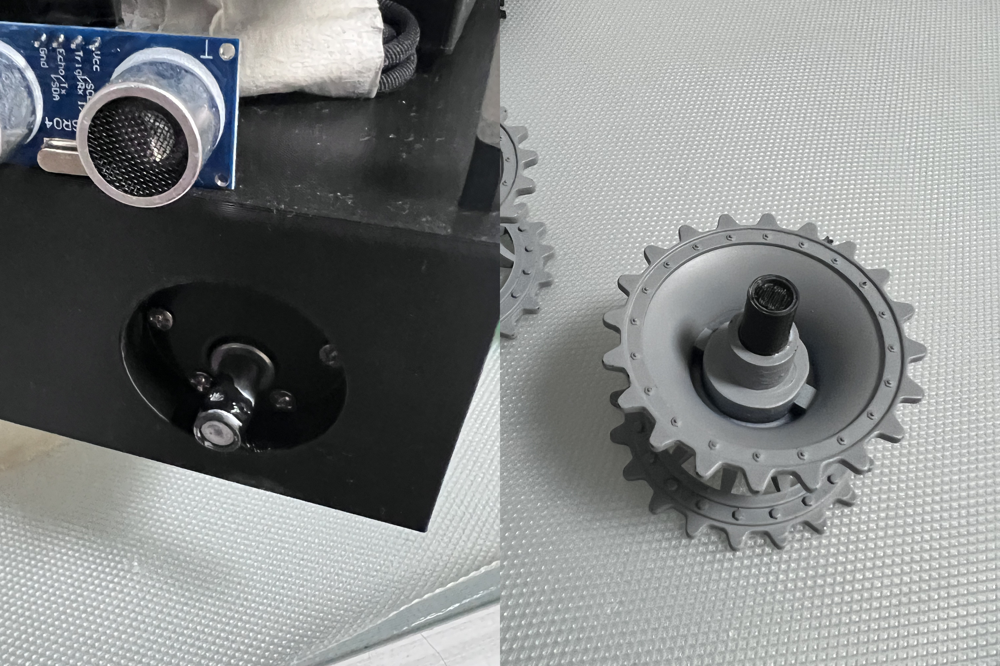

   Figure 15: Finished Hardware

PID controller works fine, but while moving the car, the coupler **snapped once again**. Since this entire project is self-funded and I have blasted a hole through my wallet, I had to save future costs of remaking and repurchasing this coupler and motor. Therefore, I decided to just get a full tank kit with correctly sized motors with encoders to ensure reliability. This way I can focus on what matters more, which is my SLAM and higher level algorithms. Though, what I 3D designed, the chassis and coupler, I wouldn't say its a waste of time since I did learn quite abit from this.

12 May 2026 — New Kit
-----------------------------
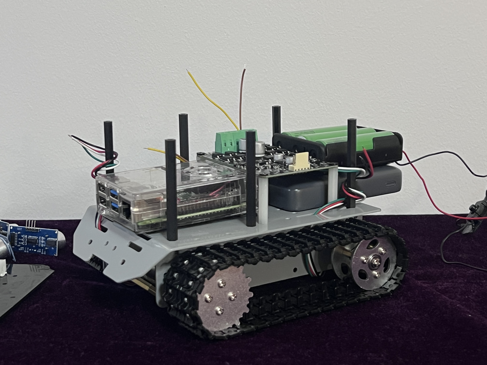

   Figure 16: In progress

Figure 16 shows my new chassis halfway built. Had to think about placement of sensors, how to fit my lidar on top, ensuring maximum usage of space in this smaller chassis. Also had to ensure that weight is at best equally distributed.

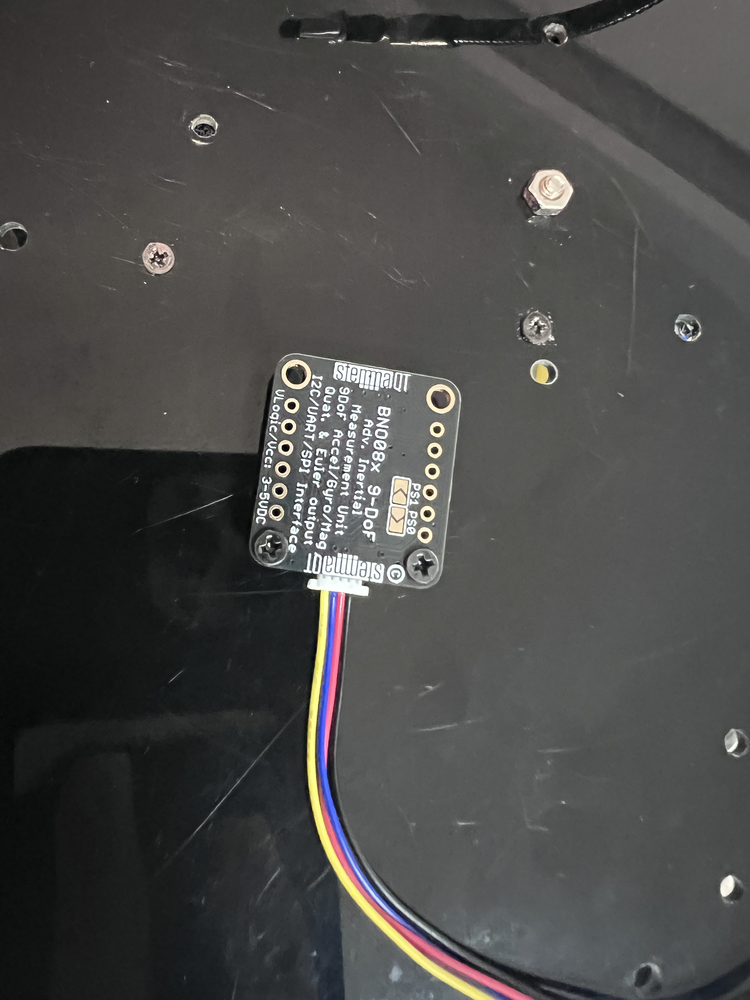

   Figure 17: New IMU

Figure 17 shows a new IMU I bought. It is the BN0085 which has 9 degree of freedom. During implementation, I ensured that it is in the geometrical center of my build with z axis facing upwards, etc.

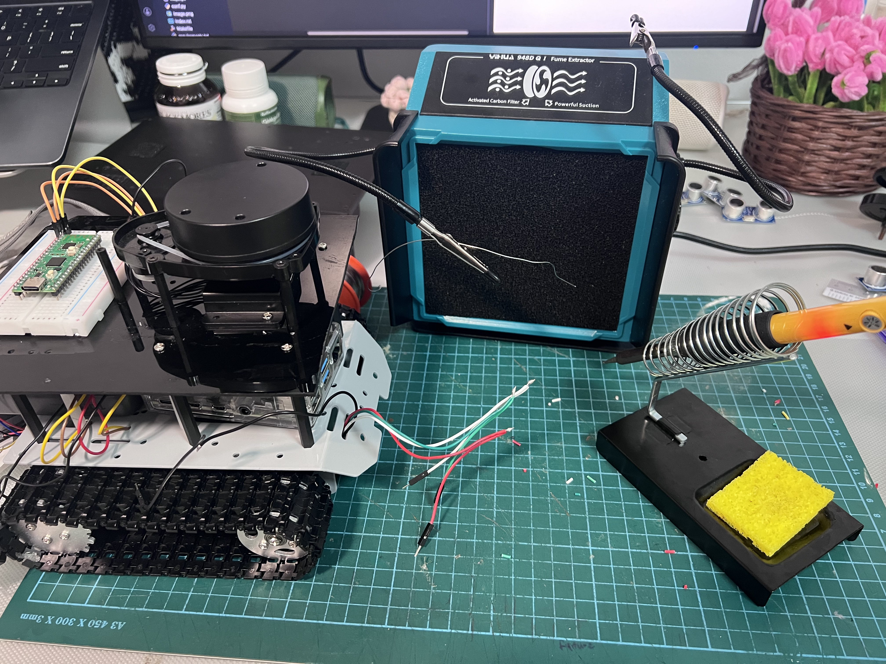

   Figure 18: Soldering

Figure 18 shows some soldering work that I also did with this new kit. Mainly for the motor's connections.

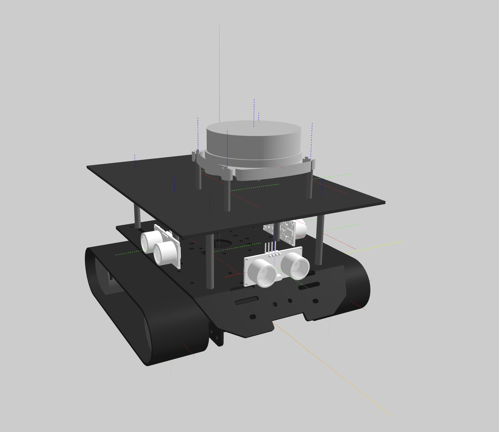

   Figure 19: URDF

Figure 19 shows the new model that i built as a urdf file and visualized using urdf-visualizer extension in vscode. I used provided chassis and ultrasonic sensors stl files in this design. I also added frame links in relation to base link.

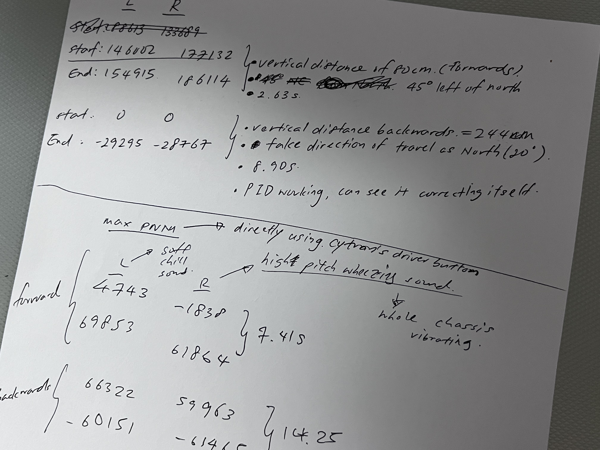

   Figure 20: Testing Notes

From Figure 20, we can see my testing notes. I tested the max speed and minimum duty cycle using debug code. I used encoder counts to estimate the distance and calculated the speed at max duty cycle (using timer from my stopwatch). As for minimum duty cycle, I create a debug code that steps down the duty cycle every 3 seconds, and I can manually count and see at which duty cycle the car can no longer move. However, from all these testing, I noticed the somehow the right motor is significantly weaker than the left.

20 May 2026 — Integration hell
-------------------------------

.. raw:: html

   <figure style="text-align: center;">
   <video width="640" height="360" controls style="display: block; margin: auto;">
      <source src="../_static/reflections_vid3.mp4" type="video/mp4">
      Your browser does not support the video tag.
   </video>
   <figcaption style="color: gray; margin-top: 0.8em;">Video 3: Tank forward movement biasing right</figcaption>
   </figure>

From Video 3 above, we can see that the tank is moving to the right significantly. This meant that the left motor could be stronger than the right. After checking against the published encoder ticks, I could verify this as the ticks were off by about 25%.

I thoroughly checked through my code because I thought it was a software issue, but there were nothing that caught my attention or could cause alarms.

To minimize possibility of PID implementation issue, I ran a quick debug code to test the car via the same teleop node but without PID control (so purely open loop), but the same issue arised. Nevertheless, I went straight to my Motor Driver board to test. The Cytron MDD10A has 4 built-in testing buttons that allow for current to flow directly to the motors. 

.. raw:: html

   <figure style="text-align: center;">
   <video width="640" height="360" controls style="display: block; margin: auto;">
      <source src="../_static/reflections_vid4.mp4" type="video/mp4">
      Your browser does not support the video tag.
   </video>
   <figcaption style="color: gray; margin-top: 0.8em;">Video 4: Difference in sound between left and right motor</figcaption>
   </figure>

From Video 4, we can clearly hear the difference is sound of motor when its running at max speed. This is using the bypass test buttons built-in on the motor driver. My worry is that there is a manufacturing defact of the right motor. However to be very sure, I decided to switch the motor's Output A and B on the motor driver. Meaning left motor's wiring to driver is replaced with right motor's wiring to driver, and vice versa. This is to see if the motor driver is the issue. However, after switching same thing happened, meaning motor driver was never the issue. 

.. raw:: html

   <figure style="text-align: center;">
   <video width="640" height="360" controls style="display: block; margin: auto;">
      <source src="../_static/reflections_vid5.mp4" type="video/mp4">
      Your browser does not support the video tag.
   </video>
   <figcaption style="color: gray; margin-top: 0.8em;">Video 5: Clanking sound when shaking right motor</figcaption>
   </figure>

Video 5 represents a clanking sound when shaking the right motor after removing it. This was my last straw. I decided that it was a faulty motor.

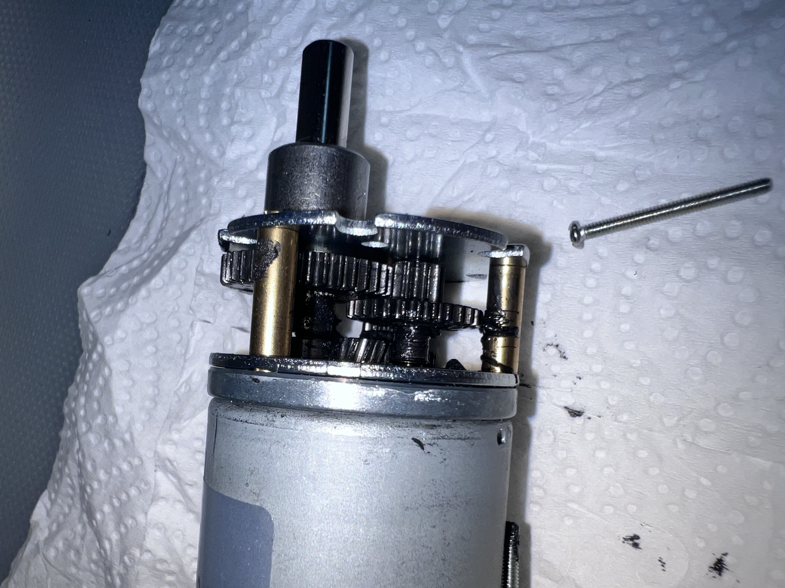

   Figure 21: Motor Close Up

Figure 21 shows the motor when I removed the gear cover. I didn't see anything odd, just poor lubrication. When I shake the motor I could still hear the clanging, and I knew it was something to do with the interal windings of the actual motor itself. But I decided not to pursue this any further and just purchase new motors (with spares cos I can't afford waiting another 1.5 weeks whenever this happens).

23 May 2026 — RViz & Gazebo
---------------------------

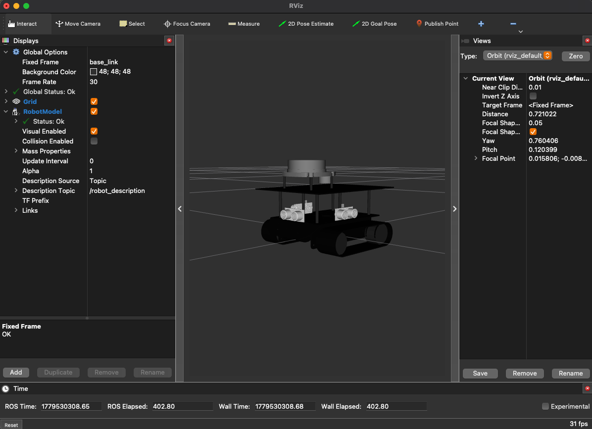

   Figure 22: RViz

Figure 22 shows my RViz model. Managed to set it up on my mac with much difficulty (thanks to apple sillicon).

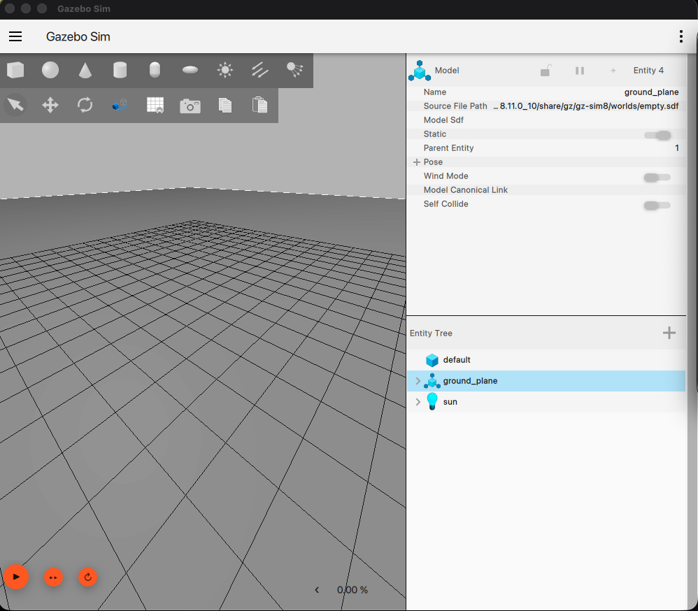

   Figure 23: Gazebo

Figure 23 shows Gazebo setup on my mac (also a pain due to apple's sillicon). 

29 May 2026 — IMU
------------------
When i tried running the BNO085 IMU, the ROS 2 topic ``/sensors/imu`` appeared, but no data was being published to that topic. I thought it was my firmware issue, because I had to create the fully written BNO085 driver on the pico W built around the SH2 library using I2C. So I used the built-in I2C GPIO pins on the Rasberry Pi 4 for testing. 

**Here are some things I did to debug this:**

- swapped SDA/SCL pair in case cables were reversed
- confirmed 3.29V with multimeter at sensor and a lit up IMU board
- tried 2 different STEMMA QT cables
- continuity tested the blue (SDA) cable
- pulsed RST pin to force hardware reset
- used rpi4 to test if imu can be detected using ``i2c detect``

**Problem 1: I2C Timing Violation**

- SCL and SDA are both open-drain, meaning devices can only pull a line *low*
- SDA needs to be stable before SCL risess
- BNO085 uses **clock stretching** which holds SCL low to signal that its not ready yet
- the problem comes when it releases SCL after stretching, it sometimes haven't finished settling SDA
- so SDA changes too close to, or even after the clock edge
- the data is sampled mid-transition and the byte is garbage or the device never appears to acknowledge at all

**Problem 2: Pi's I2C clock-stretching bug**

- i found online that Rasberry Pi's hardware I2C has a long-standing bug where it does not honour clock stretching properly

**Solution: Swap to UART-RVC Mode**

- BNO085 supports I2C, SPI, and UART
- UART-RVC stands for Robotics Vehicle Control
- a simplified, continuous serial communication protocol designed for hardware like the BNO085/BNO086 IMUs and robot vacuum cleaners
- UART is asynchronous and does not require clock wire to get out of sync with data
- they simply agree on a baud rate (115200)
- the sensor pushes a fixed-format packet out its TX line on a timer and the Pi listens on its RX line
- RCV gives Yaw, pitch, roll, linear acc automatic streaming at a fixed rate

**I found an alternative (Software bit-banged I2C on rpi4)**

- Eventually I came back and got I2C working on the rpi4
- Im using a software bit-banged I2C bus on a free GPIO pair instead of the hardware I2C peripheral (which im been using)
- Bit-banging means the Pi manually toggles the pins in software, which correctly honours clock stretching because I'm in full control of the timing

29 May 2026 — LIDAR
--------------------
.. raw:: html

   <figure style="text-align: center;">
   <video width="640" height="360" controls style="display: block; margin: auto;">
      <source src="../_static/reflections_vid6.mp4" type="video/mp4">
      Your browser does not support the video tag.
   </video>
   <figcaption style="color: gray; margin-top: 0.8em;">Video 6: LIDAR spinning</figcaption>
   </figure>

This took me long enough, but finally I have started setting up the LIDAR and its spinning. Managed to make the LIDAR node work and I was able to see the msg being published on my lidar topic. Next was setting it up so that I can see the laser scan on rviz.

30 May 2026 — RViz2
--------------------

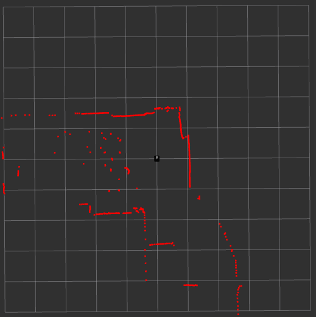

   Figure 24: lidar scans in rviz

Figure 24 shows my live lidar scans in my living room while my tank is stationary. The amount of satisfaction and dopamine I got from reaching this and actually seeing my lidar scan cannot be described by words. Month of grinding hardware, firmware and finally it paid off. Now I understand laying that base hardware foundation for any product/project is so important to ensure the later stages won't fall short. 

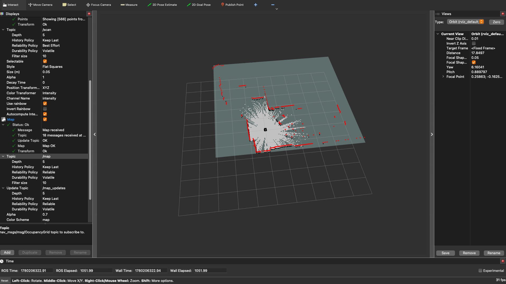

   Figure 25: added map in rviz

Figure 25 shows my live lidar scans + my map in my living room, while stationary too.

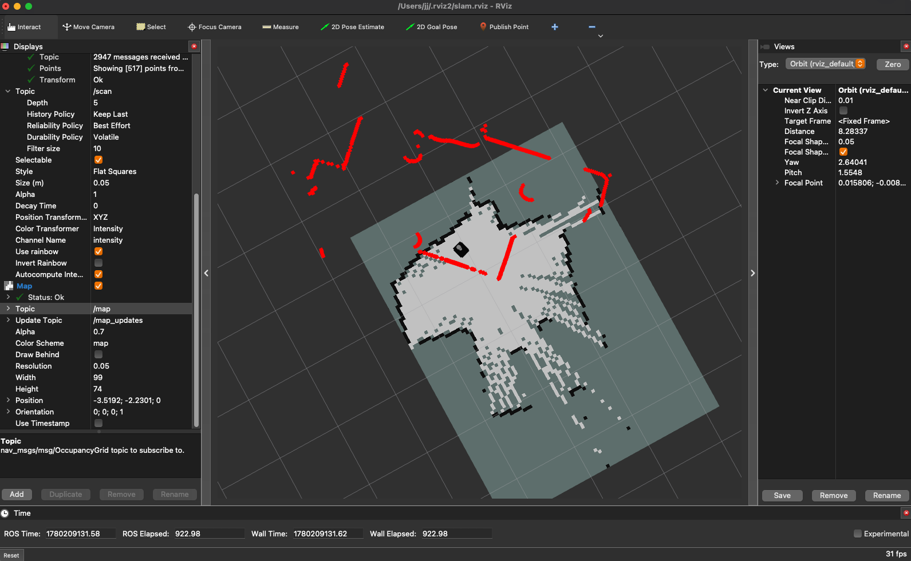

   Figure 26: alot of drift

In Figure 26, I was just driving around my living room, and it shows the drift between lidar and map. I noticed that when I move forwards in real life, the tank moved backwards in RViz. This was very odd. I went to check the axis and i realised that the red axis (+x) was facing backwards in RViz.This didn't make sense because I checked my urdf file and there was no problem.

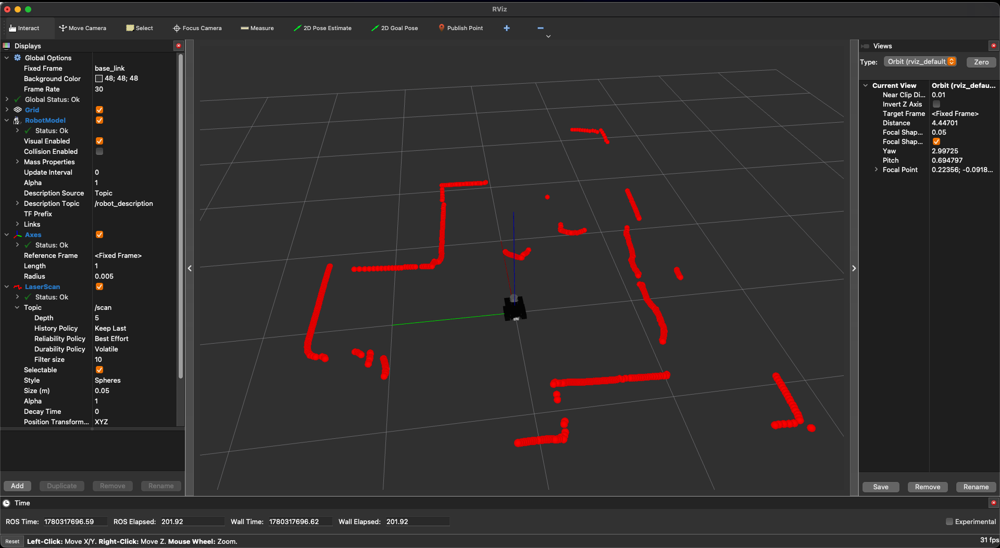

   Figure 27: fixed axis

Figure 27 shows the problem finally fixed. The red axis which represents the positive x direction is finally pointing in the same direction as in real life. Even though the problem occured just a few lines before, I actually spent a whole gruesome day trying to debug... running through my codebase and finding anything that is causing this issue. I went through my urdf joint origins, checked my mesh files orientation, verified tf tree in rviz, re-examined how ``robot_state_publisher`` was broadcasting transforms. The whole time the answer was sitting right there. The embarrassing error was that I didn't include a 0.000 in my rpy variable ``Rotation: in RPY (degree) [0.000, -0.000, 180.000]``. This made me realised that I need to pay more attention to the little details.

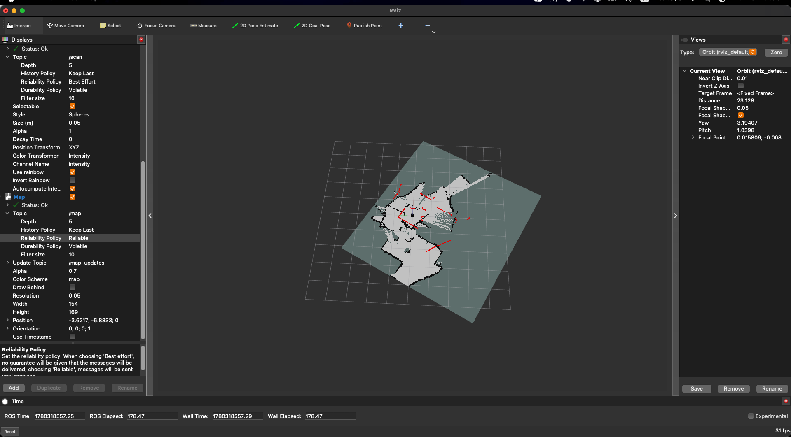

   Figure 28: drift

Figure 28 shows another problem of drift. I verified that ``/odom``, ``/scan``, and ``sensors/imu`` were all actively publishing using ``ros2 topic hz``, and confirmed the EKF was outputting /odometry/filtered. I also suspected that my odom was not doing so well, at this point I tuned the EKF to weight odometry more heavily for linear velocity, since my IMU integration tends to drift on that axis. 

I also understand that my LIDAR may be giving poor results due to the characteristics of my living room, such as many dark coloured objects (sofa, piano), which abosrbs infrared light rather than reflecting it back, so the LIDAR struggles to detct them reliably. On top of that, my living room has long flat walls with no distinctive features, which makes it hard for the scan-matcher to localise accurately. I also found another issue where, my map doesn't show the rear of my bin even after moving behind it.

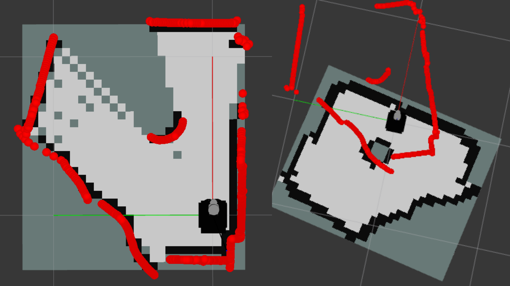

   Figure 29: Before (left) and After (right) of mapping a smaller area

Figure 29 shows the before and after of mapping a smaller area i created. I realised that this drastically helps with the mapping of rear of objects, since the rear of the bin is now properly shown as a fully round object. However, the drift is still a problem.

