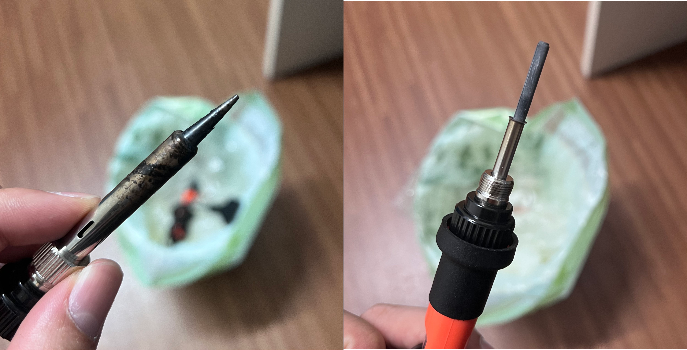

Reflections
================

See also: :doc:`ROS 2 Notes <ros2>`

A personal log of difficulties faced, solutions found, and lessons learned
while building the autonomous tank.

Brutally Honest, Unflitered Background
------------------------------------------------

I started this project because I realised how cooked I was with regards to my future career.

Past 2 years of Uni (Y1 & Y2) was just studying a lot of math and physics subjects. I studied really hard (was still adjusting from NS to Y1), took exams and then called it a day. But in Y3S2 (during my internship at ST Engineering), I realised that the modules taken in Y1-2 did not exactly prepare me enough for what I might face when I actually become an engineer.

This was when I decided to take on this project. I knew I wanted to do something related to my initial specialization, Robotics & Automation (now changed to ML). That's why I thought about a robotic car.

However, after dwelving into agentic AI quite a bit, I wanted to incorporate AI into my project. That's where Computer Vision comes in (I know agents and CV is quite different...). This project is also a very good precursor to my FYP which is incoporating (Vision Transformers + Large Language Models = Vision Language Model) + Action --->  Vision Language Action in robotic systems.

I believe understanding the fundamentals of Ultrasonic Sensors, LIDARS, SLAM, ROS2, Nav2, will certainly give me an edge in robotics, especially when I would want to do something related to my FYP for my future job (AI + Robotics).

Therefore, I decided to make Self-driving Robotic Car. Since, I extended my internship such that it ends just before Y4S1 starts, I decided that that should be my deadline. With all that yapping, lets move on with the timelines!

----

26 Feb 26 — Start of Project
------------------------------

**What I did**

After researching and consulting AI what I should purchase, I spend nearly a crazy ~$200 out of my own pocket to purchase the items that included Rasberry Pi 4, Pico W, YDLidar X3 Pro, basic arduino car kit (included with motors), H bridge, 18560 batteries.

.. figure:: ../_images/reflections_img1.png
   :alt: Before building
   :width: 500px
   :align: center

   Figure 1: Before building version 1

When the kit in Figure 1 came, I was eager to build it. I followed some YouTube Tutorial on it and started building. I learnt how to write a simple micropython script and then make it such that it recieves the velocity commands over USB to my RPI4. I avoided touching ROS2 to reduce complexity and ensure hardware, wiring is also correct.

.. figure:: ../_images/reflections_img2.jpg
   :alt: After building
   :width: 500px
   :align: center

   Figure 2: After building version 1

As shown in Figure 2 above, my current build contains RPI4, Pico W, 18650 batteries, the L298N H Bridge that is wired to my motors. The L298N required many connections. For a 4 wheel (4 motor) setup, I had to combine the motor voltage wires together for each side. Dir pins control both motors at each side.

This "simple" setup, took me awhile because of many problems. The table below shows some problems faced and respective solutions.

.. list-table::
   :header-rows: 1
   :widths: 50 50

   *  - Problem
      - Solution

   *  - weak (loose) connection
      - wiggle the wires to make sure they don't just fall out and secure them if they do fall out
   *  - code issues
      - make changes to the code and verify with AI (my project mentor)
   *  - motor forward/backward direction issues
      - switch the pins (best to switch it hardware wise than software which might confuse myself in the future when reviewing the codebase)
   *  - cold solder joints
      - fill edges of soldering iron's tip with solder first, repeat it multiple times, and ensure that soldering joint is hot

This first success building the car made me more motivated and excited to continue on with my project. 

.. raw:: html

   <figure style="text-align: center;">
     <video width="640" height="360" controls style="display: block; margin: auto;">
       <source src="/_static/reflections_vid1.mp4" type="video/mp4">
       Your browser does not support the video tag.
     </video>
     <figcaption style="color: gray; margin-top: 0.8em;">Figure 3: Car moving around and spinning</figcaption>
   </figure>

Figure 3 above shows my car finally moving, controlled via my keyboard, WASD.

----

12 Mar 26 — 1st Real Difficulty
--------------------------------

**What Happened**

.. figure:: ../_images/reflections_img5.png
   :alt: Before building
   :width: 500px
   :align: center

   Figure 4: Poor solder joint on my motors

From Figure 4, we can see that I took out the motors. This is because the motors were not reliable due to bad solder joint.

   Figure 5: Poor soldering iron quality

From Figure 5, you can tell that I was using a really cheap soldering iron and the solder connections became so unreliable, sometimes the car won't even move. This was when I knew I had to invest in a good soldering setup to ensure issues like these won't arise in the future again. 

   Figure 5: Before building version 1

I bought a new soldering iron (reddit users recommendations) and seperate quality solder with higher flux percentage as shown in Figure 6.

5 May 2026 — System Identification
-------------------------------------
- main idea is to get max velocity during full load operation
- run the car over fixed distance
